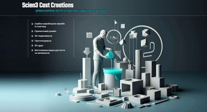

> I am a junior front-end developer.

# Real-life project for a local business: Scien3 Cast Creations

I’ve created this website for **Scien3 Cast Creations**, which is a small-batch plastic casting company. The site is mostly static, as its purpose is to provide customers with information about company’s services and how to contact them. I made it from scratch: UI, development, deployment.

I’ve followed best coding practices: components are concise and readable, the pages are semantic, accessible and responsive.

For good SEO scores I’ve also used Static Site Generation, optimized fonts and images.

## Features

- Navigate the site with ease through a clean, neumorphic design enhanced by smooth animations using Intersection Observer;
- Learn about the company's services and contacts;
- Switch between English and Ukrainian language, your choice is stored in a cookie;
- Copy email on click (with a ‘toast’ message);
- Go straight to calling with one click on the number in mobile screen size.

## Skills used

- Next.js
- TypeScript
- Sass/Scss
- Redux
- Cookies and Local Storage

## What I learned

- Using Static Site Generation;
- Deployment on server using FTP and SSH (+ domain and SSL configurations etc.);
- Images and fonts optimization;
- Creating toasts’ queue;
- Rendering modals in portals (+ focus trap);
- SEO refinement.

Here you can check out the <a href="https://scien3.com/" target="_blank">deployed site</a>!
